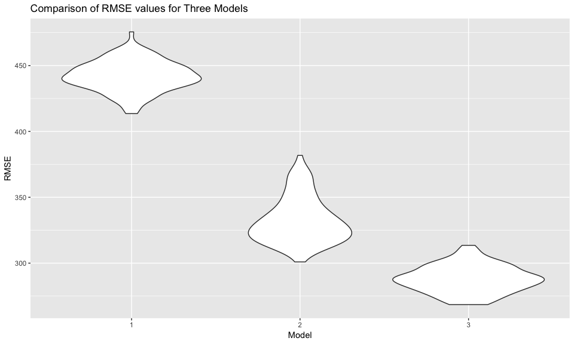

P8105\_hw6\_dm3175
================
Devon Morgan
11/20/2018

Homework 6 Solutions
====================

Homework 6 is focused on the topics included in the Linear Models module for p8105.

Problem 1
---------

The next problem explores data gathered by the Washington Post on homicides in 50 large US cities.

### Load and Clean the Data

Data was read in from a CSV posted on GitHub.

``` r
url = "https://raw.githubusercontent.com/washingtonpost/data-homicides/master/homicide-data.csv"
homicide_data = read_csv(url, na = "Unknown") %>% 
  janitor::clean_names() 
```

    ## Parsed with column specification:
    ## cols(
    ##   uid = col_character(),
    ##   reported_date = col_integer(),
    ##   victim_last = col_character(),
    ##   victim_first = col_character(),
    ##   victim_race = col_character(),
    ##   victim_age = col_integer(),
    ##   victim_sex = col_character(),
    ##   city = col_character(),
    ##   state = col_character(),
    ##   lat = col_double(),
    ##   lon = col_double(),
    ##   disposition = col_character()
    ## )

Data cleaning steps were subsequently followed:

``` r
clean_homicide_data = homicide_data %>% 
  mutate(city_state = str_c(city, ", ", state),
         resolved = ifelse(disposition == "Closed by arrest", 1, 0),
         victim_race = ifelse(victim_race == "White", "white", "non-white"),
         victim_race = fct_relevel(victim_race, "white"),
         victim_age = as.numeric(victim_age)) %>% 
  filter(!(city_state == "Dallas, TX" | city_state == "Phoenix, AZ" | city_state == "Kansas City, MO" | city_state == "Tulsa, AL"))
```

Cleaning steps:

-   Created a `city_state` variable combining city and state.
-   Created a binary variable `resolved` indicating if crime was solved. "1" signifies solved ("Closed by arrest"), and "0" signifies unsolved "Closed without arrest" or "Open/No arrest".
-   Modified `victim_race` to have categories "white" and "non-white", with "white" as the reference category.
-   Converted `victim_age` to numeric.
-   Filtered out Dallas, TX, Phoenix, AZ and Kansas City, MO (incomplete data for variables of interest), and Tulsa, AL (data entry error).

### Fitting logistic regression model for Baltimore, MD

Focusing on homicide data from Baltimore, MD, a logistic regression model was fitted using `glm` function with resolved vs unresolved as the outcome and victim age, sex and race as predictors.

``` r
# fit logistic regression model on baltimore data
fit_logistic_balt = clean_homicide_data %>% 
  filter(city_state == "Baltimore, MD") %>% 
  select(victim_race, victim_age, victim_sex, resolved) %>% 
  glm(resolved ~ victim_age + victim_sex + victim_race, data = ., family = binomial()) 

# tidy output for adjusted OR and confidence interval for solving homicides comparing non-white victims to white victims keeping all other variables fixed
fit_logistic_balt %>% 
broom::tidy() %>% 
  cbind(exp(confint(fit_logistic_balt))) %>% 
  mutate(OR = exp(estimate)) %>%
  filter(term == "victim_racenon-white") %>% 
  rename("conf_2.5" = "2.5 %", "conf_97.5" = "97.5 %") %>% 
  select(term, OR, conf_2.5, conf_97.5) %>% 
  knitr::kable(digits = 3)
```

    ## Waiting for profiling to be done...

| term                  |     OR|  conf\_2.5|  conf\_97.5|
|:----------------------|------:|----------:|-----------:|
| victim\_racenon-white |  0.441|      0.312|        0.62|

**Interpretation**: The table output represents the estimate and confidence interval of the adjusted odds ratio for solving homicides comparing non-white victims to white victims keeping all other variables fixed. The resulting odds ratio is less than 1, which indicates that the odds for having a homicide resolved in the non-white race victim group is lower than among whites. The results from this logistic regression model may therefore suggest that disparities exist in how likely a crime is to be resolved depending on the victims' race.

### Fitting logistic regression model for all cities

A logistic regression model was fitted for all cities using `map` and list columns. The stratified analysis allows for comparisons of adjusted odds ratios by each city to determine if differences in the estimates vary by city. As computed for the Baltimore data above, the model examines resolved vs unresolved crimes as the outcome and victim age, sex and race as predictors. The adjusted odds ratio for solving homicides comparing non-white victims to white victims keeping all other variables fixed was examined. When fitting this model, crime cases where victim sex and race were unknown were removed from the analysis.

``` r
# fitted logistic regression model by city_state
nest_fit_logistic_all = clean_homicide_data %>% 
  filter(!(victim_race == "NA" | victim_sex == "NA")) %>%
  group_by(city_state) %>%
  nest() %>%
  mutate(models = map(data, ~glm(resolved ~ victim_age + victim_sex + victim_race, data = ., family = binomial())),
         confid = map(models, broom::confint_tidy),
         models = map(models, broom::tidy)) %>% 
  select(-data) %>% 
  unnest() %>% 
# tidied the dataframe, including adding OR and CI estimate
  mutate(OR = exp(estimate),
         conf.low = exp(conf.low),
         conf.high = exp(conf.high), 
         log_OR = estimate) %>%
  filter(term == "victim_racenon-white") %>%
  select(city_state, term, OR, conf.low, conf.high)
```

#### Plot of estimated ORs and CIs for each city

The adjusted odds ratio for solving homicides comparing non-white victims to white victims keeping all other variables fixed was plotted for each city along with 95% confidence intervals. The resulting plot shows that OR values are generally less than 1 (except for Tampa, FL, Birmingham, AL and Durham, NC, although these estimates have large confidence intervals due to smaller sample sizes), indicating that homicides where the victim is non-white are generally less likely to be resolved than those when the victim is white. Note that the plot indicates that the value of the OR varies by City.

``` r
nest_fit_logistic_all %>%
  mutate(city_state = forcats::fct_reorder(city_state, desc(OR))) %>% 
  ggplot(aes(x = city_state, y = OR)) +
  geom_point() +
  geom_errorbar(aes(x = city_state, ymin = conf.low, ymax = conf.high)) +
  theme(axis.text.x = element_text(angle = 80, hjust = 1), text = element_text(size = 10)) +
  labs(title = "Adjusted OR for Solving Homicides of Non-White vs. White keeping Sex and Age Constant, by City",
         x = "City, State",
         y = "OR (95% CI)")
```


Problem 2
---------

This problem uses data gathered to understand the effects of several variables on a child's birthweight.

### Load and Tidy Data

``` r
birthweight_data = read_csv(file = "./data/birthweight.csv") %>% 
  janitor::clean_names()
```

    ## Parsed with column specification:
    ## cols(
    ##   .default = col_integer(),
    ##   gaweeks = col_double(),
    ##   ppbmi = col_double(),
    ##   smoken = col_double()
    ## )

    ## See spec(...) for full column specifications.

``` r
tidy_birthweight_data = birthweight_data %>% 
  mutate(babysex = as.numeric(babysex), 
         frace = as.factor(frace),
         malform = as.factor(malform), 
         mrace = as.factor(mrace),
         wtgain = as.numeric(wtgain),
         mheight = as.numeric(mheight),
         gaweeks = as.numeric(gaweeks),
         fincome = as.numeric(fincome), 
         blength = as.numeric(blength))
```

Used `skimr::skim()` to check for any missing data points and there were none. Converted relevant variables to factor variables and to numeric when appropriate. Note that `babysex` variable had two possible values (male = 1, female = 2), and coded as numeric for the subsequent model to run.

### Regression Model for Birthweight

To select the covariates to include in the model, a report published by UNICEF (UNICEF. 2004. "Low Birthweight: Country, Regional and Global Estimates" <https://www.unicef.org/publications/files/low_birthweight_from_EY.pdf>) was consulted to investigate factors associated with the mother which may impact birthweight. The goal of this particular model was to examine what **maternal factors** may predict birthweight, which could represent a possible target for public health interventions to reduce low birthweight by targetting susceptible mothers prior to birth. Various combinations of the suggested factors were tested and adjusted R^2 values were compared for different models when adding subsequent new variables. Increases in adjusted R^2 values indicate that the inclusion of the variable improves prediction of the response. The following variables were included in the model 1 (`fit_lm_birthweight_1`) describing maternal influences of birthweight.

-   Mother height (`mheight`)
-   Smoking (`smoken`)
-   Pregnancy Duration (`gaweeks`)
-   SES status measured through family income (`fincome`)
-   Maternal weight gain during pregnancy (`wtgain`)

Additional variables investigated but not included due to not impacting adjusted R2 when added:

-   Parity (`parity`)
-   Mother BMI (`mbmi`)
-   Gestational Age (`gaweeks`)
-   Maternal pre-pregnancy weight (`ppwt`)

``` r
fit_lm_birthweight_1 = lm(bwt ~ wtgain + smoken + mheight + fincome + gaweeks, data = birthweight_data) 

fit_lm_birthweight_1 %>%
    broom::glance() %>%
    knitr::kable(digits = 3)
```

|       |  r.squared|  adj.r.squared|    sigma|  statistic|  p.value|   df|     logLik|       AIC|      BIC|   deviance|  df.residual|
|-------|----------:|--------------:|--------:|----------:|--------:|----:|----------:|---------:|--------:|----------:|------------:|
| value |      0.253|          0.252|  442.982|     293.31|        0|    6|  -32616.13|  65246.26|  65290.9|  850866502|         4336|

``` r
fit_lm_birthweight_1 %>%
    broom::tidy() %>%
    knitr::kable(digits = 3)
```

| term        |   estimate|  std.error|  statistic|  p.value|
|:------------|----------:|----------:|----------:|--------:|
| (Intercept) |  -1365.026|    178.196|     -7.660|        0|
| wtgain      |      8.900|      0.622|     14.303|        0|
| smoken      |     -7.726|      0.912|     -8.470|        0|
| mheight     |     29.480|      2.562|     11.508|        0|
| fincome     |      2.112|      0.263|      8.026|        0|
| gaweeks     |     59.604|      2.171|     27.457|        0|

The resulting adjusted R^2 value for the model was 0.2518807.

### Plot of Predictions and Residuals

Below is a plot of model residuals against predicted birthweight values. While the residuals are clustered in the middle, and do not appear to have a clear pattern, there are definitely outliers present at smaller predicted values. This indicates that there may be some issues with the proposed model. Possible solutions could include developing a rule to remove outliers from the data set or transforming (e.g. using a log transformation) some variables.

``` r
tidy_birthweight_data %>% 
    modelr::add_predictions(fit_lm_birthweight_1) %>% 
    modelr::add_residuals(fit_lm_birthweight_1) %>%
    ggplot(aes(x = pred, y = resid)) +
    geom_point(alpha = 0.5) +
    labs(title = "Model 1: Plot of Residuals Against Predicted Birthweight Values",
         x = "Predicted Values",
         y = "Residuals")
```


### Comparison of Model Against Two Others

The proposed model was compared against two others. The first model (`fit_lm_birthweight_2`) was one using using length at birth and gestational age as predictors (main effects only). The second model (`fit_lm_birthweight_3`) used head circumference, length, sex, and all interactions (including the three-way interaction) between these variables.

``` r
fit_lm_birthweight_2 = lm(bwt ~ blength + gaweeks, data = birthweight_data) 

  fit_lm_birthweight_2 %>%
    broom::glance() %>% 
    knitr::kable(digits = 3)
```

|       |  r.squared|  adj.r.squared|    sigma|  statistic|  p.value|   df|     logLik|       AIC|       BIC|   deviance|  df.residual|
|-------|----------:|--------------:|--------:|----------:|--------:|----:|----------:|---------:|---------:|----------:|------------:|
| value |      0.577|          0.577|  333.217|   2958.001|        0|    3|  -31381.32|  62770.64|  62796.14|  481775846|         4339|

``` r
  fit_lm_birthweight_2 %>%
    broom::tidy() %>% 
    knitr::kable(digits = 3)
```

| term        |   estimate|  std.error|  statistic|  p.value|
|:------------|----------:|----------:|----------:|--------:|
| (Intercept) |  -4347.667|     97.958|    -44.383|        0|
| blength     |    128.556|      1.990|     64.604|        0|
| gaweeks     |     27.047|      1.718|     15.744|        0|

``` r
fit_lm_birthweight_3 = lm(bwt ~ bhead * blength * babysex, data = birthweight_data) 

fit_lm_birthweight_3 %>%
    broom::glance() %>% 
    knitr::kable(digits = 3)
```

|       |  r.squared|  adj.r.squared|    sigma|  statistic|  p.value|   df|    logLik|       AIC|       BIC|   deviance|  df.residual|
|-------|----------:|--------------:|--------:|----------:|--------:|----:|---------:|---------:|---------:|----------:|------------:|
| value |      0.685|          0.684|  287.734|   1345.616|        0|    8|  -30741.6|  61501.19|  61558.58|  358816655|         4334|

``` r
fit_lm_birthweight_3 %>%
    broom::tidy() %>% 
    knitr::kable(digits = 3)
```

| term                  |    estimate|  std.error|  statistic|  p.value|
|:----------------------|-----------:|----------:|----------:|--------:|
| (Intercept)           |  -13551.685|   2759.413|     -4.911|     0.00|
| bhead                 |     380.189|     83.395|      4.559|     0.00|
| blength               |     225.900|     57.398|      3.936|     0.00|
| babysex               |    6374.868|   1677.767|      3.800|     0.00|
| bhead:blength         |      -4.432|      1.715|     -2.583|     0.01|
| bhead:babysex         |    -198.393|     51.092|     -3.883|     0.00|
| blength:babysex       |    -123.773|     35.119|     -3.524|     0.00|
| bhead:blength:babysex |       3.878|      1.057|      3.670|     0.00|

#### Cross Validation and Comparison on Models

The model was compared to the two alternative proposed models using `crossv_mc` and functions in `purrr`. The resulting plots of RMSEs demonstrate that Model 3 (including head circumference, length, sex, and all interactions (including the three-way interaction) between these) has the smallest RMSE, indicating that this model works the best for the data. Model 2 (including blength + gaweeks) had the second smallest RMSE. The proposed model incorporating maternal factors (model 1, including wtgain + smoken + mheight + fincome + gaweeks) had the largest RMSE value, indicating that this model was the least effective in prediction accurary compared to the other two models. This may suggest that this model should be revisited in the future and improved to decrease the RMSE. Moreover, focusing on some key maternal factors in model 1 to predict birthweight may be important but not as predictive as the other variables included in the other models.

``` r
set.seed(1)

cv_birthweight_df = 
  crossv_mc(tidy_birthweight_data, 100)

cv_birthweight_df = 
  cv_birthweight_df %>% 
  mutate(fit_lm_birthweight_1 = map(train, ~lm(bwt ~ wtgain + smoken + mheight + fincome + gaweeks, data = birthweight_data)),
         fit_lm_birthweight_2 = map(train, ~lm(bwt ~ blength + gaweeks, data = birthweight_data)),
         fit_lm_birthweight_3 = map(train, ~lm(bwt ~ bhead * blength * babysex, data = birthweight_data))) %>%
  mutate(rmse_1 = map2_dbl(fit_lm_birthweight_1, test, ~rmse(model = .x, data = .y)),
         rmse_2 = map2_dbl(fit_lm_birthweight_2, test, ~rmse(model = .x, data = .y)),
         rmse_3 = map2_dbl(fit_lm_birthweight_3, test, ~rmse(model = .x, data = .y)))

cv_birthweight_df %>% 
  select(starts_with("rmse")) %>% 
  gather(key = model, value = rmse) %>% 
  mutate(model = str_replace(model, "rmse_", ""),
         model = fct_inorder(model)) %>% 
  ggplot(aes(x = model, y = rmse)) + 
  geom_violin() +
  labs(title = "Comparison of RMSE values for Three Models",
         x = "Model",
         y = "RMSE")
```


